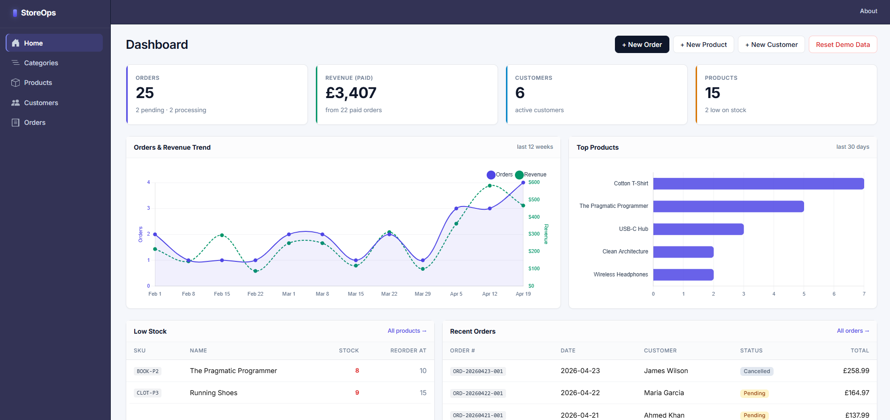
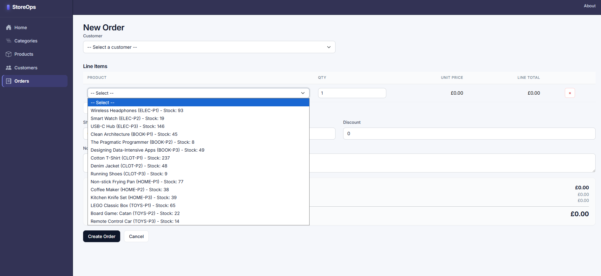
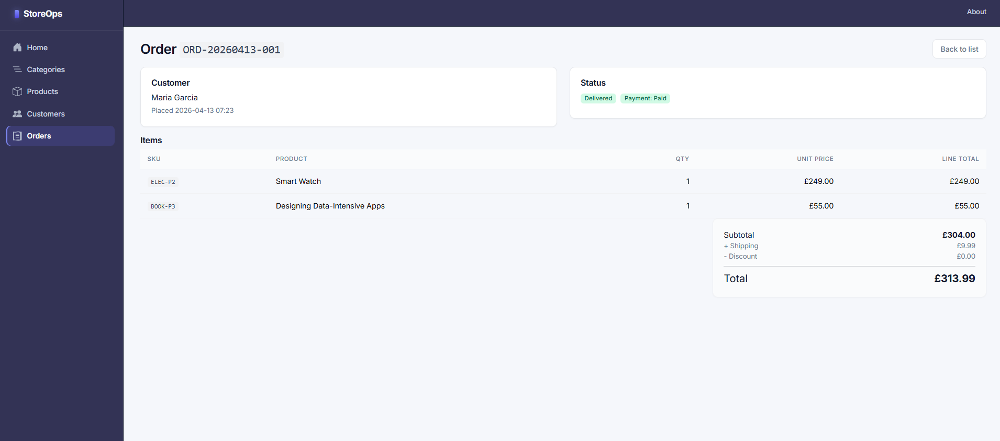
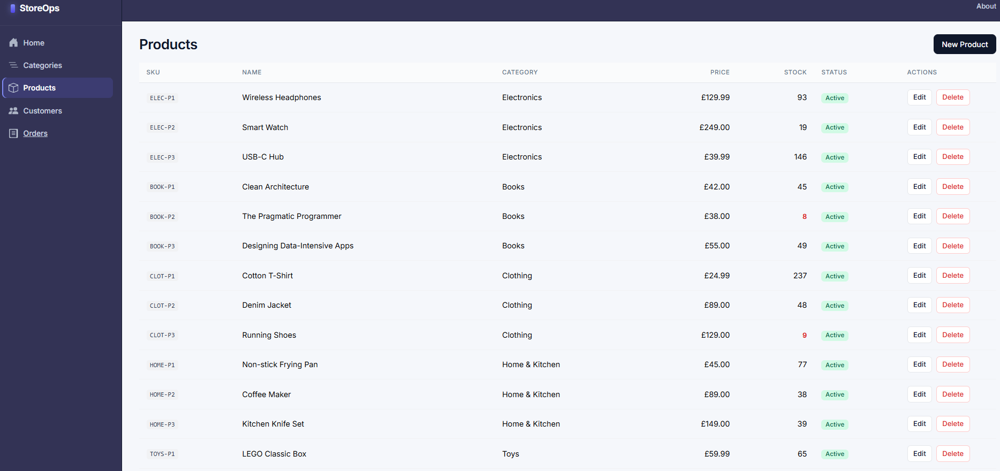
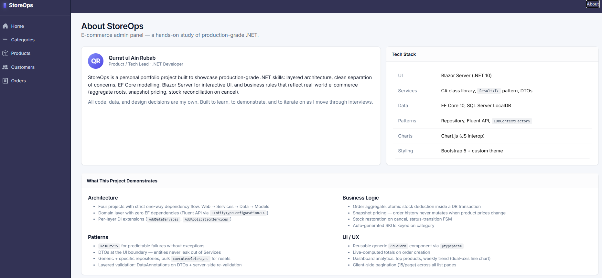

# StoreOps

Lightweight e-commerce admin panel for small-to-mid-sized stores. Built as a hands-on study of production-grade .NET: layered architecture, EF Core, and Blazor Server — from domain model all the way to UI.

## Screenshots

<table>
<tr>
<td colspan="2" align="center">

<br/>
<em><strong>Dashboard</strong> — Stat cards for orders, paid revenue, customers, and products. Dual-axis line chart (Chart.js) plots orders + revenue across 12 weekly buckets; horizontal bar chart shows top products by units sold over 30 days (cancelled orders excluded). All aggregations run through a dedicated <code>AnalyticsService</code> using <code>IDbContextFactory</code> for SQL-side <code>GROUP BY</code> queries.</em>
</td>
</tr>
<tr>
<td width="50%">

<br/>
<em><strong>Order creation</strong> — Customer dropdown, dynamically add/remove line items with live-computed subtotal and total. Submit triggers atomic stock deduction inside an EF Core transaction; <code>UnitPrice</code> is snapshotted from each product so historical orders stay immutable when prices later change.</em>
</td>
<td width="50%">

<br/>
<em><strong>Order details</strong> — Full order view with customer, line items, and computed totals. Status-change buttons enforce a finite-state machine (Pending → Processing → Shipped → Delivered; Cancel from any non-terminal state). Cancelling transactionally restores stock to the source products.</em>
</td>
</tr>
<tr>
<td width="50%">

<br/>
<em><strong>Products list</strong> — Client-side pagination (15 per page), low-stock rows called out in red. Category name is denormalized onto the DTO via <code>Include()</code> to avoid N+1 queries. New-product SKUs are auto-generated from the selected category (e.g. <code>ELEC-P1</code>, <code>BOOK-P3</code>) with per-category sequence numbers.</em>
</td>
<td width="50%">

<br/>
<em><strong>About page</strong> — Project context and architectural summary. Dark slate sidebar + top bar with a light content area; theme is a layer of CSS custom properties on top of Bootstrap 5.</em>
</td>
</tr>
</table>

## Stack

| Layer | Tech |
|-------|------|
| UI | Blazor Server (.NET 10), interactive server render mode, Bootstrap 5 |
| Services | C# class library, `Result<T>` pattern, DTOs, manual mapping |
| Data | EF Core 10, SQL Server LocalDB, `IEntityTypeConfiguration<T>`, `IDbContextFactory` |
| Models | Plain POCOs — zero EF dependency (Fluent API only) |

## Architecture

Four projects with strict one-way dependency flow:

```
StoreOps (Web) ──▶ StoreOps.Services ──▶ StoreOps.Data ──▶ StoreOps.Models
```

- **StoreOps.Models** — domain entities, enums, `BaseEntity` (Id, CreatedAt, UpdatedAt, IsActive). No EF attributes — the domain knows nothing about how it's persisted.
- **StoreOps.Data** — `AppDbContext`, one `IEntityTypeConfiguration<T>` per entity, generic + specific repositories, `IDbContextFactory<AppDbContext>` for Blazor circuit safety.
- **StoreOps.Services** — business rules, validation, DTOs (read/create/update), `Result<T>` pattern for predictable failures without exceptions.
- **StoreOps** — Blazor Server UI, DI wire-up, connection-string config.

## Domain

Core entities (see `StoreOps.Models`):
`Category`, `Product`, `Customer`, `Coupon`, `Order`, `OrderItem`, `Payment`, `InventoryTransaction`.

Design choices:
- Soft delete via `IsActive` on every entity.
- Money stored as `decimal` with `HasPrecision(18, 2)` — never `double`/`float`.
- Aggregate roots: `Order` owns `OrderItem` + `Payment` (Cascade). `Product` / `Category` deletes are **Restricted** to preserve historical order data.
- Snapshot pricing: `OrderItem.UnitPrice` is copied at order time so past orders don't mutate when product prices change.

## Patterns used

- **Clean / layered architecture** with a DI extension per layer (`AddDataServices`, `AddApplicationServices`)
- **Repository pattern** — generic `IRepository<T>` + specific interfaces where named queries are needed
- **DTO boundary** — UI never touches entities
- **`Result<T>`** — business failures are data, not exceptions
- **`IDbContextFactory<T>`** — short-lived contexts per operation, avoids the Blazor long-lived-context trap (tracker bloat, stale data)
- **Fluent API** via `IEntityTypeConfiguration<T>` + `ApplyConfigurationsFromAssembly` — one config file per entity
- **Layered validation** — DataAnnotations on DTOs for client-side UX; service re-validates server-side for correctness

## Running locally

Prerequisites:
- .NET 10 SDK
- SQL Server LocalDB

```bash
# one-time: create and start a LocalDB instance named "Projects"
sqllocaldb create Projects
sqllocaldb start Projects

# copy the dev settings template (it is gitignored)
cp StoreOps/appsettings.Development.json.example StoreOps/appsettings.Development.json

# restore, apply migrations, run
dotnet restore
dotnet ef database update --project StoreOps.Data --startup-project StoreOps
dotnet run --project StoreOps
```

Default connection string points at `Server=(localdb)\Projects;Database=StoreOps;Trusted_Connection=True`.

## Status

- [x] Domain model — 8 entities, 5 enums, all EF configurations
- [x] Data layer — generic + specific repositories, `IDbContextFactory`, migrations
- [x] Service layer across all modules — `Result<T>`, DTOs, manual mapping
- [x] Category CRUD
- [x] Product CRUD with auto-generated SKUs from category name
- [x] Customer CRUD
- [x] Order aggregate — dynamic line items, atomic stock deduction, status FSM with stock restoration on cancel
- [x] Dashboard — stat cards + Chart.js trend and top-products charts (`AnalyticsService`)
- [x] Client-side pagination (15 per page) on all list pages
- [x] Seed data generator with dev-only "Reset Demo Data" button
- [x] Modern slate theme — dark sidebar, light content area
- [ ] ASP.NET Identity + role-based authorization
- [ ] Deploy to Azure App Service (live demo URL)
- [ ] Coupon / Payment / Inventory-transaction UIs (models and schema already in place)

## Branching

- `main` — known-good, always runnable
- `dev` — integration branch; features merge here first
- `feature/<name>` — per-module work (e.g. `feature/product-module`)

## License

Portfolio / learning project.
